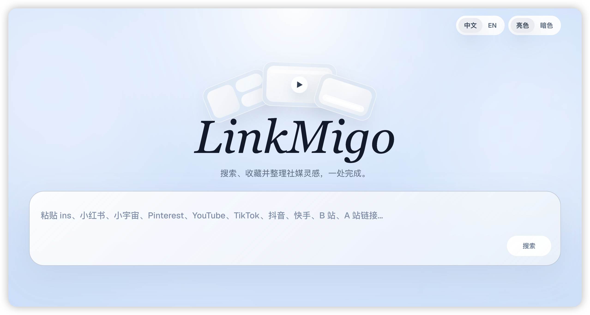
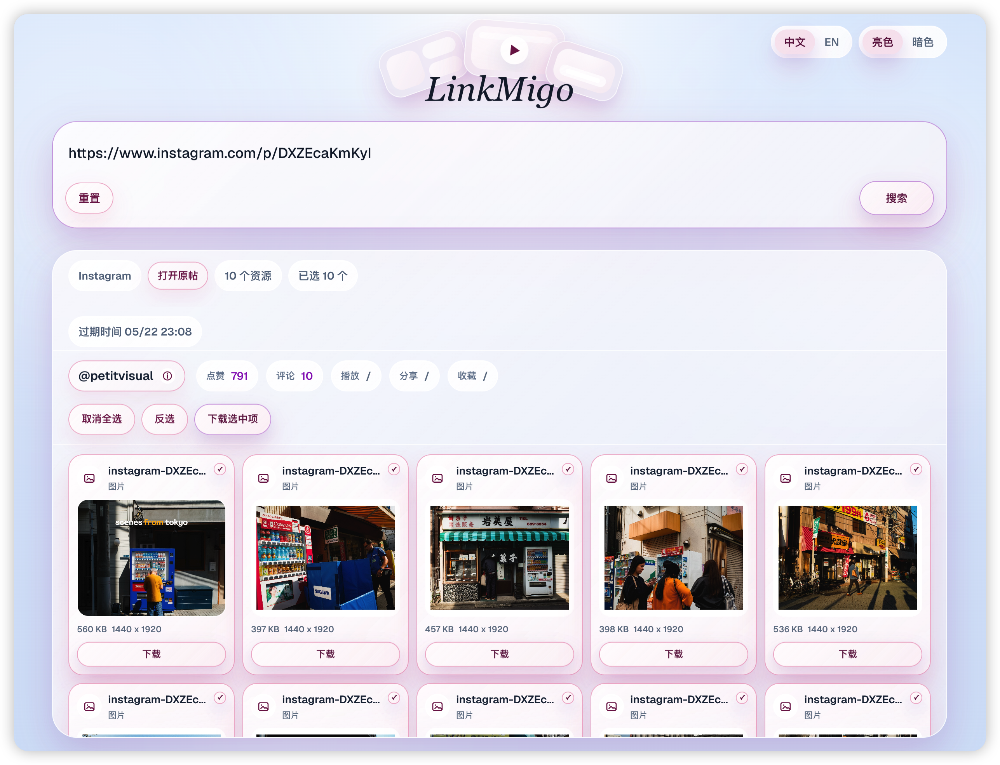
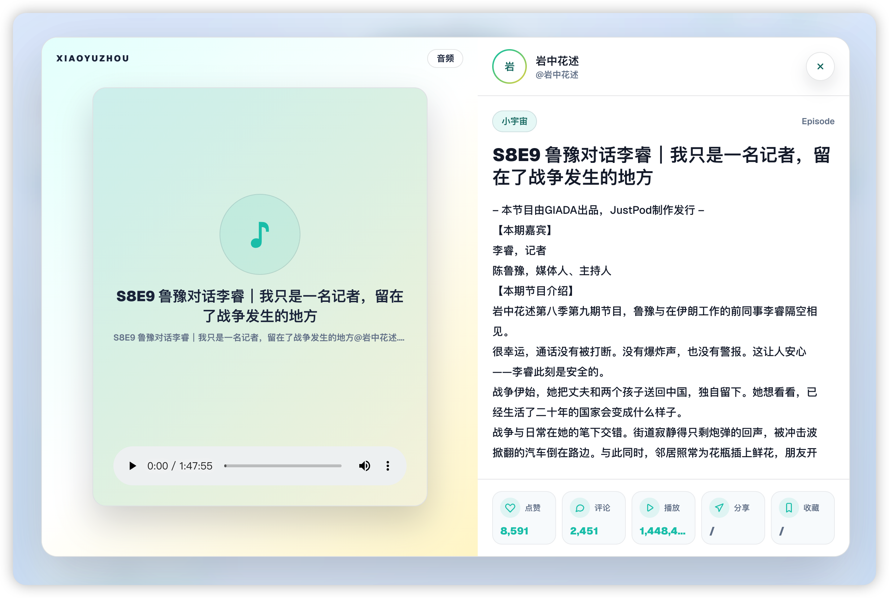
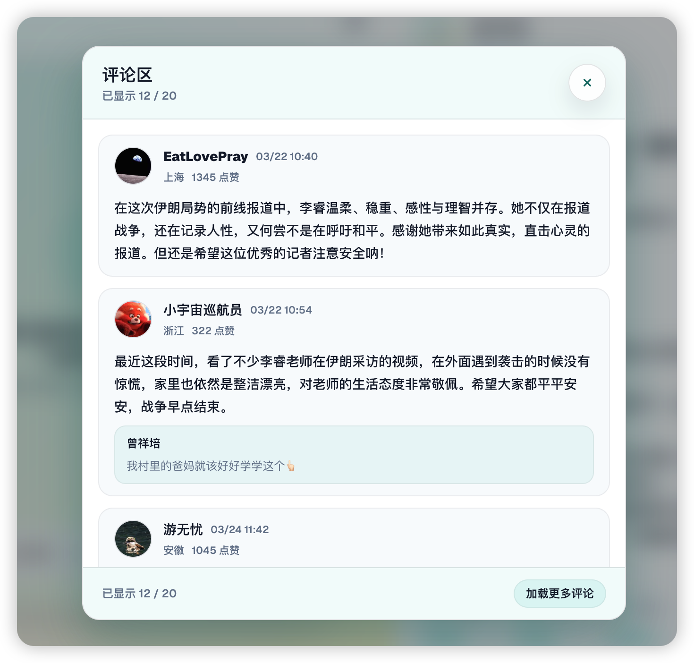

## LinkMigo

LinkMigo「链密狗」是一款社媒公开资源解析下载工具。你可以粘贴公开视频、图文、音频或帖子链接，服务端会解析公开页面、缓存可下载资源，并在前端提供预览、选择下载、打包下载和帖子信息查看。








## 🦸‍♂️ 支持平台

目前支持解析这些平台的公开链接：

| 平台 | 支持内容 |
| --- | --- |
| Instagram | 公开图片、视频 |
| Threads | 公开图片、视频 |
| TikTok | 公开视频 |
| 抖音 | 公开视频 |
| 小红书 | 公开图文、视频 |
| 快手 | 公开视频 |
| AcFun | 公开视频 |
| Twitter/X | 公开图片、视频 |
| Bilibili | 公开视频资源 |
| Pinterest | 公开图片、视频 |
| Reddit | 公开帖子图片、图集、视频 |
| V2EX | 公开图片 |
| 小宇宙 | 公开单集音频、单集Show Notes、公开页面评论快照 |
| YouTube | 公开视频 |
| Pornhub | 公开视频 |


## 📋 功能概览

- 自动识别平台：粘贴链接后自动匹配平台主题。
- 服务端解析和缓存：媒体资源会先缓存到本地，方便预览和下载。
- 资源预览：支持图片、视频和音频预览。
- 批量操作：支持全选、反选、下载选中项和打包下载。
- 帖子信息弹窗：展示标题、正文、作者、标签、播放、评论、点赞等公开数据。
- 小宇宙增强：支持单集音频播放、音频文件按「单集标题@主播名」命名、评论弹窗和点击复制评论。其他平台的评论区内容正在适配……
- 代理配置：可使用系统代理，也可通过环境变量手动指定代理。



## 🚗 快速开始

安装依赖：

```bash
npm install
```

启动开发环境：

```bash
npm run dev
```

开发服务会监听所有本机网卡。你可以用下面的地址访问：

```text
http://localhost:3000
```

同一局域网设备也可以通过本机 IP 访问：

```text
http://<本机 IP>:3000
```

生产构建并启动：

```bash
npm run build
npm run start
```

## 🔌 API 调用

项目提供 HTTP API，可用于其他项目提交解析任务、轮询进度、接收回调通知和下载资源。完整接口说明见 [docs/api.md](docs/api.md)。

## 🐳 Docker 和 NAS 部署

项目根目录提供了一份可直接用于 NAS 或服务器部署的 `compose.yaml`。当前 Docker Hub 镜像按芯片架构拆分 tag，请根据你的设备架构选择镜像：

| 设备芯片架构 | compose 镜像 tag |
| --- | --- |
| x86_64 / amd64，例如绿联 DXP 6800 Plus、常见 Intel/AMD NAS | `k21vin/linkmigo:latest-amd64` |
| ARM64 / aarch64，例如部分 ARM NAS、树莓派 64 位系统 | `k21vin/linkmigo:latest-arm64` |

默认 `compose.yaml` 使用的是 x86_64 / amd64 版本：

```yaml
services:
  linkmigo:
    image: k21vin/linkmigo:latest-amd64
    container_name: linkmigo
    restart: unless-stopped
    ports:
      - 3000:3000
    environment:
      NODE_ENV: production
      LINKMIGO_APP_NAME: LinkMigo
      YTDL_NO_DEBUG_FILE: "1"
      SOCIAL_CACHE_DIR: /data/social-downloader
      SOCIAL_CACHE_TTL_SECONDS: "7200"
      SOCIAL_CACHE_CLEANUP_INTERVAL_SECONDS: "300"
      SOCIAL_MEDIA_TIMEOUT_SECONDS: "600"
      SOCIAL_RESOLVE_CONCURRENCY: "4"
      SOCIAL_XIAOHONGSHU_RESOLVE_CONCURRENCY: "1"
      SOCIAL_ASSET_DOWNLOAD_CONCURRENCY: "1"
      SOCIAL_PROFILE_ZIP_CONCURRENCY: "1"
      SOCIAL_MAX_ASSET_BYTES: "10737418240"
      SOCIAL_AUTO_SYSTEM_PROXY: "0"
      # SOCIAL_INSTAGRAM_COOKIE: 你的INS
      # SOCIAL_PROXY_URL: "http://host.docker.internal:7890" # 代理
    volumes:
      - ./social-downloader:/data/social-downloader
      - ./logs:/app/logs
    extra_hosts:
      - "host.docker.internal:host-gateway"
```

如果你的设备是 ARM64，把 `image` 改成：

```yaml
image: k21vin/linkmigo:latest-arm64
```

在 NAS 或服务器上部署：

```bash
mkdir -p social-downloader logs
# 使用仓库当前代码构建（包含 yt-dlp 下载引擎）
docker compose up -d --build
```

仅使用已发布镜像时才执行 `docker compose pull`；修改 LinkMigo 代码后，单纯 `docker compose restart` 不会更新镜像内容。

访问地址：

```text
http://<NAS IP>:3000
```

常用环境变量：

| 变量名 | 默认值 | 说明 |
| --- | --- | --- |
| `LINKMIGO_APP_NAME` | `LinkMigo` | 自定义页面标题和首页主标题；Docker/NAS 部署时可在环境变量里改成自己的应用名。 |
| `THEME`（或 `LINKMIGO_THEME`） | `default` | 全局 UI 风格。未设置、留空或填入未知值时使用现有默认主题；填 `cohere` 启用 `design-md/cohere/DESIGN.md` 规范的 Cohere 风格。支持亮色/暗色切换。 |
| `LINKMIGO_URL_PLACEHOLDER` | `支持 Instagram、Threads、小红书、小宇宙、V2EX、Reddit、Pinterest、YouTube、TikTok、抖音、快手、B 站、A 站链接...` | 自定义首页输入框的占位文案；留空时使用默认文案。 |
| `LINKMIGO_URL_PLACEHOLDER_EN` | `Paste Instagram, Xiaohongshu, Xiaoyuzhou, V2EX, Reddit, Pinterest, YouTube, TikTok, Douyin, Kuaishou, Bilibili, or AcFun URL...` | 自定义英文版首页输入框的占位文案；留空时使用内置英文文案。 |
| `SOCIAL_CACHE_DIR` | `.cache/social-downloader`；Docker 示例为 `/data/social-downloader` | 服务端缓存已解析媒体资源的位置。Docker 部署时建议映射到 NAS/服务器持久化目录。 |
| `SOCIAL_CACHE_TTL_SECONDS` | `7200` | 缓存资源保留时长，单位秒。 |
| `SOCIAL_CACHE_CLEANUP_INTERVAL_SECONDS` | `300` | 过期缓存清理间隔，单位秒。 |
| `SOCIAL_MEDIA_TIMEOUT_SECONDS` | `600` | 单个媒体下载超时时间，单位秒。 |
| `SOCIAL_RESOLVE_CONCURRENCY` | `4` | 全局解析任务并发数。 |
| `SOCIAL_XIAOHONGSHU_RESOLVE_CONCURRENCY` | `1` | 小红书解析并发数。 |
| `SOCIAL_ASSET_DOWNLOAD_CONCURRENCY` | `1` | 单个解析任务内媒体下载并发数。 |
| `SOCIAL_PROFILE_ZIP_CONCURRENCY` | `1` | Instagram 主页批量打包时的帖子解析并发数。 |
| `SOCIAL_MAX_ASSET_BYTES` | `10737418240` | 单个资源最大下载体积，单位字节。 |
| `SOCIAL_AUTO_SYSTEM_PROXY` | `1` | 是否自动读取系统代理；Docker/NAS 通常建议设为 `0`，并手动配置 `SOCIAL_PROXY_URL`。 |
| `SOCIAL_PROXY_URL` | 空 | 服务端访问外部平台使用的代理，例如 `http://192.168.1.10:7890`。Docker 内不要填宿主机的 `127.0.0.1`。 |
| `SOCIAL_INSTAGRAM_COOKIE` | 空 | Instagram 登录 Cookie，用于读取需要登录、年龄或地区限制的公开内容。 |
| `SOCIAL_XIAOHONGSHU_COOKIE` | 空 | 小红书登录 Cookie，用于读取匿名公开页受限但登录后可访问的笔记。 |
| `SOCIAL_REDDIT_CLIENT_ID` | 空 | Reddit OAuth app 的 client id。 |
| `SOCIAL_REDDIT_CLIENT_SECRET` | 空 | Reddit OAuth app 的 secret，可选。 |
| `SOCIAL_REDDIT_USER_AGENT` | `web:linkmigo:0.1.0 (by /u/linkmigo_user)` | Reddit API 使用的唯一 User-Agent。 |
| `SOCIAL_PUBLIC_BASE_URL` | 自动从请求推断 | API 回调中生成绝对下载链接时使用的公网基础地址。 |

本地开发时也可以把这些变量写入 `.env.local`。改完环境变量后需要重启开发服务或 Docker 容器。

发布多架构镜像到 Docker Hub：

```bash
docker login
npm run docker:buildx -- --image 你的DockerHub用户名/linkmigo --tags "latest"
```

Docker Desktop 通常已经内置跨架构构建支持。如果在普通 Linux 主机上构建并遇到 `exec format error` 或 arm64/amd64 仿真问题，可以先启用 binfmt/QEMU：

```bash
docker run --privileged --rm tonistiigi/binfmt --install all
```

同时发布版本号和 `latest`：

```bash
npm run docker:buildx -- --image 你的DockerHub用户名/linkmigo --tags "0.1.0 latest"
```

默认构建平台是：

```text
linux/amd64,linux/arm64
```

默认 Docker 镜像内置 Chromium，用于 Instagram 主页等需要浏览器渲染的解析兜底。构建时可以指定 Debian 镜像源以提高 Chromium 依赖下载稳定性：

```bash
npm run docker:buildx -- --image 你的DockerHub用户名/linkmigo --tags "latest" --install-chromium --apt-mirror http://mirrors.ustc.edu.cn
```

只想在本机试打当前架构镜像，不推送到 Docker Hub：

```bash
npm run docker:buildx:local
```

如果想把打包和推送拆开，可以先分别打出本地 `amd64` 和 `arm64` 镜像：

```bash
npm run docker:build:local-platforms -- --image 你的DockerHub用户名/linkmigo --tags "0.1.0 latest"
```

项目的 `.dockerignore` 已排除 `*.tar` 和 `*.tar.gz`。如果你先用 `docker save` 导出了旧镜像包，再重新构建新镜像，必须避免这些旧包进入 Docker build context；否则旧 tar 会被 `COPY . .` 复制到 `/app`，导致镜像体积异常变大，但不会让应用更完整。

这会在本地生成这些标签：

```text
你的DockerHub用户名/linkmigo:0.1.0-amd64
你的DockerHub用户名/linkmigo:0.1.0-arm64
你的DockerHub用户名/linkmigo:latest-amd64
你的DockerHub用户名/linkmigo:latest-arm64
```

确认本地镜像没问题后，再推送架构标签并创建多架构 manifest：

```bash
docker login
npm run docker:push:manifest -- --image 你的DockerHub用户名/linkmigo --tags "0.1.0 latest"
```


## 🧙‍♀️ 法师

### YouTube 下载引擎

YouTube 下载使用 Node 调用持续更新的 `yt-dlp` 可执行文件，由它负责播放器签名、分段下载和 ffmpeg 合并。项目 Docker 镜像会自动安装对应架构的 `yt-dlp`；非 Docker 部署会在首次使用 YouTube 时自动下载到缓存目录，也可以自行安装后指定：

```bash
YTDLP_PATH=/usr/local/bin/yt-dlp
```

默认把 Node 作为 yt-dlp 的 JavaScript runtime，用于执行 YouTube 播放器签名脚本；如需切换到其他已安装 runtime，可设置 `YTDLP_JS_RUNTIME`。

如果运行环境不能访问 GitHub，可关闭自动下载并提供系统内的二进制：

```bash
YTDLP_AUTO_DOWNLOAD=0
YTDLP_PATH=/usr/local/bin/yt-dlp
```

需要登录 Cookie 时，可以配置 `YTDLP_COOKIES_FILE=/path/to/cookies.txt`。这条链路完全由 JS/Node 编排，不需要在 LinkMigo 中运行 Python。

服务端会优先使用当前网络环境直接访问外网。如果「魔法」是全局路由或 TUN 模式，通常不需要额外配置；如果「魔法」客户端是系统代理模式，服务端会在没有手动代理环境变量时自动读取系统 HTTP、HTTPS 或 SOCKS5 代理。

如果服务端访问 Instagram、Threads、TikTok、抖音、小红书、快手、AcFun、Pinterest、Reddit、V2EX、YouTube、Pornhub 等平台时提示“上游访问受限”，可以创建 `.env.local` 手动指定代理：

```bash
SOCIAL_PROXY_URL=http://127.0.0.1:7890
```

也可以使用这些兼容变量：

```bash
IG_PROXY_URL=http://127.0.0.1:7890
HTTPS_PROXY=http://127.0.0.1:7890
HTTP_PROXY=http://127.0.0.1:7890
ALL_PROXY=http://127.0.0.1:7890
```

如果不想自动读取系统代理，可以在 `.env.local` 里关闭：

```bash
SOCIAL_AUTO_SYSTEM_PROXY=0
```

如果 VPN 使用 PAC 自动代理脚本，而不是明确的系统 HTTP、HTTPS 或 SOCKS5 代理端口，Node 服务端可能无法解析 PAC，建议手动配置 `SOCIAL_PROXY_URL`。

如果 Instagram 返回“年龄或地区限制”“需要登录”等提示，匿名公开接口无法读取该内容。可以在 `.env.local` 配置一个你自己已登录、且能正常查看该内容的 Instagram Cookie：

```bash
SOCIAL_INSTAGRAM_COOKIE='sessionid=...; ds_user_id=...; csrftoken=...'
```

获取 Cookie 的一种方式：

1. 在 Chrome 或 Edge 里登录 Instagram，并确认浏览器里能打开目标帖子。
2. 打开开发者工具：`F12`，或 macOS 上按 `Option + Command + I`。
3. 进入 `Application` 面板，左侧选择 `Storage` -> `Cookies` -> `https://www.instagram.com`。
4. 在 Cookie 表格里找到 `sessionid`、`ds_user_id`、`csrftoken` 三行，分别复制它们的 `Value`。
5. 按下面格式拼成一行，写入 `.env.local`：

```bash
SOCIAL_INSTAGRAM_COOKIE='sessionid=你的_sessionid; ds_user_id=你的_ds_user_id; csrftoken=你的_csrftoken'
```

如果在 `Application` 面板里找不到，也可以打开 `Network` 面板，刷新 Instagram 页面，点选 `www.instagram.com` 的请求，在 `Headers` -> `Request Headers` 里复制 `Cookie` 这一整行的值。复制后可以直接填入变量；至少需要包含 `sessionid`、`ds_user_id`、`csrftoken`。

也可以使用兼容变量：

```bash
IG_COOKIE='sessionid=...; ds_user_id=...; csrftoken=...'
INSTAGRAM_COOKIE='sessionid=...; ds_user_id=...; csrftoken=...'
```

保存后重启开发服务。Cookie 等同于登录凭证，只在本机使用，不要提交到 Git，也不要发给他人。

如果小红书提示“安全验证”“当前笔记暂时无法浏览”或匿名公开页面无法解析，但你在浏览器登录后可以正常打开该笔记，可以在 `.env.local` 配置小红书 Cookie：

```bash
SOCIAL_XIAOHONGSHU_COOKIE='a1=...; web_session=...; webId=...'
```

获取方式和 Instagram 类似：

1. 在 Chrome 或 Edge 里登录小红书，并确认浏览器里能打开目标笔记。
2. 打开开发者工具，进入 `Application` -> `Storage` -> `Cookies` -> `https://www.xiaohongshu.com`。
3. 复制该站点下的 Cookie，至少应包含登录态相关字段，例如 `web_session`。
4. 写入 `.env.local` 后重启开发服务。

也可以使用兼容变量：

```bash
SOCIAL_XHS_COOKIE='a1=...; web_session=...; webId=...'
XIAOHONGSHU_COOKIE='a1=...; web_session=...; webId=...'
XHS_COOKIE='a1=...; web_session=...; webId=...'
```

如果同一个账号在浏览器里也打不开该笔记，服务端无法解析，这是平台对该笔记本身的访问限制。

小红书也支持在页面中点击“小红书扫码登录”。二维码登录只绑定当前浏览器：浏览器保存的是 LinkMigo 会话 Cookie，实际的小红书登录 Cookie 保存在服务端内存中，不会写入前端 `localStorage`，也不会在用户之间共享。扫码登录依赖服务器上可用的 Chromium/Google Chrome；如果服务器没有浏览器，可继续使用上面的环境变量方式。

Reddit 现在经常拒绝未授权的 `.json` 公开请求。建议创建一个 Reddit app，并在 `.env.local` 配置 OAuth client id 和唯一 User-Agent：

1. 打开 https://www.reddit.com/prefs/apps 并登录 Reddit。
2. 点击页面底部的 `are you a developer? create an app...`。
3. 类型选择 `script`。
4. `name` 可填 `linkmigo`，`redirect uri` 可填 `http://localhost:8080`。
5. 创建后回到 app 列表：
   - `SOCIAL_REDDIT_CLIENT_ID`：app 名字下面、`personal use script` 附近那串短 ID。
   - `SOCIAL_REDDIT_CLIENT_SECRET`：`secret` 后面那串。
   - `SOCIAL_REDDIT_USER_AGENT`：自己定义一个唯一标识，建议包含项目名和 Reddit 用户名。

```bash
SOCIAL_REDDIT_CLIENT_ID=你的_reddit_client_id
SOCIAL_REDDIT_USER_AGENT=web:linkmigo:0.1.0 (by /u/你的reddit用户名)
```

如果创建的是带 secret 的脚本应用，可以同时配置：

```bash
SOCIAL_REDDIT_CLIENT_SECRET=你的_reddit_client_secret
```


## ⏬ 缓存和下载限制

资源下载后会先保存在本地缓存目录。默认保存路径是：

```bash
.cache/social-downloader
```

这是一个隐藏文件夹。如果需要指定为其他位置，可以在 `.env.local` 里配置：

```bash
SOCIAL_CACHE_DIR=downloads/social-downloader
```

默认情况下，解析出来的资源会在服务端缓存 2 小时，并由服务端定时清理过期缓存。可以在 `.env.local` 里调整缓存保存时长、轮询清理间隔和媒体下载超时，单位都是秒：

```bash
# 自定义「资源存放时长」和「轮询间隔时间」
# 资源存放时长（秒）
SOCIAL_CACHE_TTL_SECONDS=7200
# 轮询间隔时间「秒」
SOCIAL_CACHE_CLEANUP_INTERVAL_SECONDS=300
# 媒体文件下载超时「秒」
SOCIAL_MEDIA_TIMEOUT_SECONDS=600
```

默认允许 4 个解析任务同时运行，以便多个用户可以同时使用；小红书默认同一时间只跑 1 个解析任务，避免同平台同 IP 的请求互相触发风控；单个帖子内部仍按原来的方式串行下载资源。如果目标平台开始限流，建议优先调低对应平台并发：

```bash
SOCIAL_RESOLVE_CONCURRENCY=4
SOCIAL_XIAOHONGSHU_RESOLVE_CONCURRENCY=1
SOCIAL_ASSET_DOWNLOAD_CONCURRENCY=1
SOCIAL_PROFILE_ZIP_CONCURRENCY=1
```

如果同一个公开链接在缓存目录尚未清理前被再次解析，服务端会复用已有资源，并把该记录的过期时间重新延后一个缓存周期，减少重复下载和频繁清理。

如果需要手动清空缓存资源和对应的过期时间记录，可以运行：

```bash
npm run cache:clear
```

清理前可以先预览将要清理的缓存目录和条目数量：

```bash
npm run cache:clear -- --dry-run
```

单个资源默认最多下载 10 GB。部分长视频平台资源可能更大，如果需要调整，可以配置字节数：

```bash
SOCIAL_MAX_ASSET_BYTES=10737418240
```

改完环境变量后重启开发服务：

```bash
npm run dev
```


## 💁 推荐阅读

也欢迎关注我的两个公众号：

【德育处主任】：聊 AI，聊 NAS，聊古法编程


【雷猴世界】：聊游戏、聊动漫，正在编写《任天堂物语》


